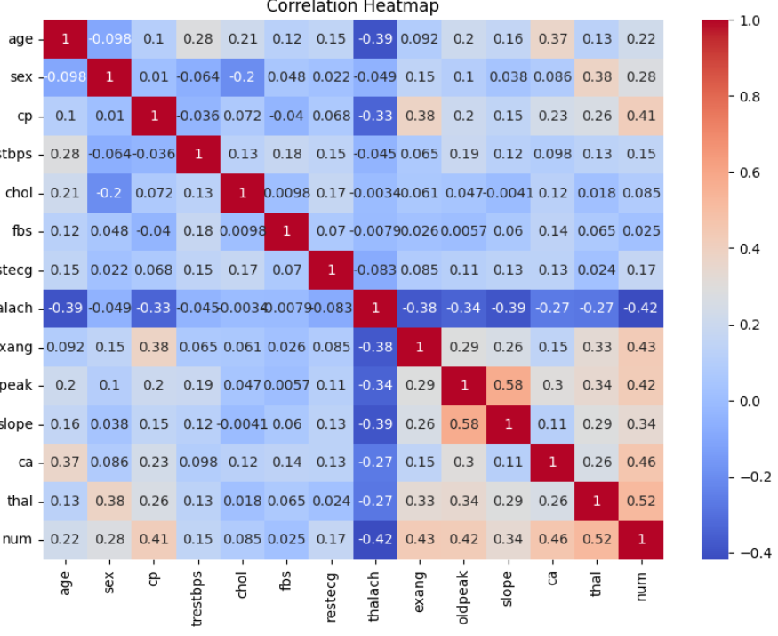

# Heart Disease Prediction with Machine Learning
This project builds ML models to classify the presence of heart disease based on patient data. It includes exploratory data analysis, feature selection, regression, classification, and clustering.

## Tools Used
- Python (pandas, NumPy, scikit-learn, matplotlib, seaborn)
- Jupyter Notebook
- Machine Learning models: Logistic Regression, Random Forest, Linear Regression
- PCA + K-Means Clustering

##  Highlights
- Data cleaning and EDA
- Cholesterol prediction using Linear Regression
- Heart disease classification with Random Forest
- Dimensionality reduction (PCA) and clustering (K-Means)

## 📁 Files
- `Heart_Disease_Modeling_Project.ipynb`
- `heart.csv`

## 📸 Sample Output

*Created for academic and learning purposes.*
